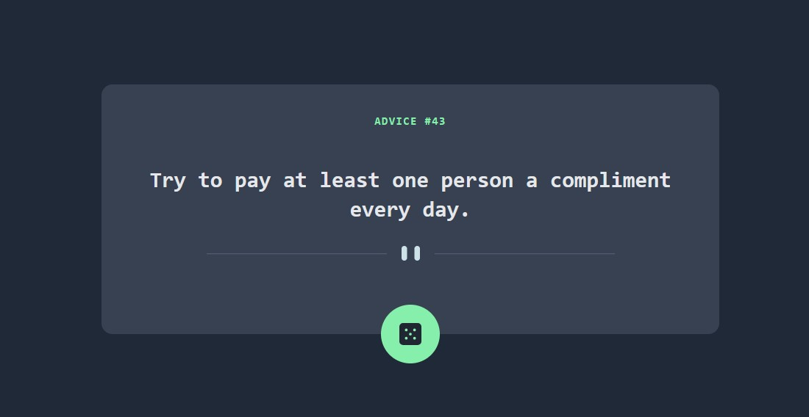

# Frontend Mentor - Advice generator app solution

This is a solution to the [Advice generator app challenge on Frontend Mentor](https://www.frontendmentor.io/challenges/advice-generator-app-QdUG-13db). Frontend Mentor challenges help you improve your coding skills by building realistic projects.

## Table of contents

- [Overview](#overview)
  - [The challenge](#the-challenge)
  - [Screenshot](#screenshot)
- [My process](#my-process)
  - [Built with](#built-with)
  - [What I learned](#what-i-learned)
  - [Continued development](#continued-development)
  - [Useful resources](#useful-resources)
- [Author](#author)


## Overview

### The challenge

Users should be able to:

- View the optimal layout for the app depending on their device's screen size
- See hover states for all interactive elements on the page
- Generate a new piece of advice by clicking the dice icon

### Screenshot



## My process

### Built with

- Semantic HTML5 markup
- Tailwind
- Mobile-first workflow

### What I learned

This project was chosen intended to be used as an easy project to learn the ropes of Tailwindcss. The first challenge I had to navigate was how to properly install and setup tailwind using Vite. Then, I navigated how to link all of this to Github.

After these challenges were resolved, I went on to learning how to actually use Tailwind. From positioning to coloring to translations to customization and all of the other fun styling concepts. While it can seem overwhelming at first, it seems apparant how Tailwind is easily customizable and can be used to produce standardized code more quickly.

Jumping over to Javascript, I also learned how to use asynchronous functions to call an API and use the information received by that API. Below is the async function that was then called as a click event in order to populate a new piece of advice from the Advice Slip API.

```js
async function getText(file) {
    let myObject = await fetch("https://api.adviceslip.com/advice");
    let myText = await myObject.json();
    TextInput.innerHTML = myText.slip.advice;
    AdviceNumber.innerHTML = myText.slip.id;
  }
```

### Continued development

Moving forward I was to continue advancing my knowledge and skills of Tailwind and API utilization. I believe that these two skill are going to be critical in my career to produce high quality, professional code in a timely manner.


### Useful resources

- [Picture Tag Resource](https://www.w3schools.com/TAGS/tag_picture.asp) - This helped me figure out how to replace the pattern divider image based on the screen size.


## Author

- Frontend Mentor - [@Dustin-11](https://www.frontendmentor.io/profile/Dustin-11)
